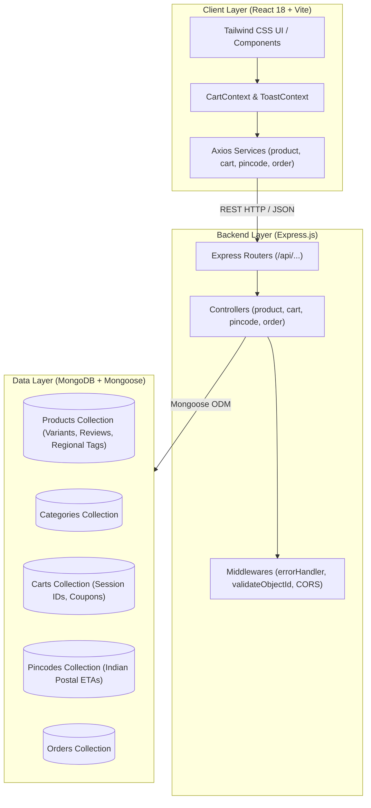

# Naik Foods E-Commerce Evolution Prototype

> **Full Stack MERN Prototype** demonstrating targeted product discovery, regional provenance, frictionless variant selection, and cart conversion improvements for **Naik Foods** (`naikfoods.co.in/in`), developed as part of the **Bits And Volts Private Limited** technical assessment.

---

## 1. Overview

**Naik Foods** is an authentic Indian culinary brand rooted in Maharashtra, celebrating traditional foods from **Vidarbha, Konkan, Pune, and Marathwada**. Their offerings range from hand-pounded black Goda masalas and sun-dried pickles to modern healthy staples like zero-maida millet noodles and roasted khakhras.

This project is **not a clone** of the legacy site. Instead, it is an **independently analyzed and engineered full-stack prototype** that targets the key conversion, discovery, and UX bottlenecks of the live website, establishing a fast, high-converting, modern direct-to-consumer (D2C) e-commerce experience.

---

## 2. Problem Understanding & Analysis

A thorough audit of the live website (`https://www.naikfoods.co.in/in`) was performed across customer journeys, page performance, and technical architecture.

### Observed Issues on Live Website:
1. **Aggressive Route-Blocking Loaders & Spinners**:
   - Every route change triggers a full-screen blocking splash spinner (*"Getting things fresh for you..."*) accompanied by layout shifts and MUI circular progress indicators, causing perceived lag and high bounce risk.
2. **Siloed Navigation & Missing Regional/Dietary Discovery**:
   - Despite Naik Foods' unique selling proposition being authentic regional provenance (Vidarbha, Konkan, Pune), the store lacks direct filtering by region.
   - Shoppers cannot filter by essential Indian dietary preferences (Jain-Friendly/No Onion-Garlic, Vegan, Millet-Based, Zero Maida) or Spice Level (Mild, Medium, Kolhapuri Teekha).
3. **High-Friction Variant & Add-to-Cart Flow**:
   - Product cards on catalog grids do not display pack sizes/weights (e.g. 100g, 180g, 200g, 500g) and offer no quick-add button. Users are forced to navigate into the PDP, wait for page hydration, select variants, and navigate back.
4. **Underutilized Cart Experience**:
   - The cart page is completely disconnected and static. An empty cart presents only a plain text link with zero product recommendations or impulse-buy cross-sells.
   - The homepage highlights *"Free Delivery - Minimum order ₹999"*, yet the cart lacks a dynamic progress meter showing how much more is required to unlock free shipping.
5. **No Instant Delivery Confidence**:
   - Delivery availability and ETA are hidden until deep checkout steps, creating purchase hesitation for regional perishable/fresh items.

---

## 3. Implemented Solution

We engineered a **production-ready MERN stack prototype** focused on speed, sensory brand storytelling, and frictionless checkout:

1. **Instant Multi-Faceted Product Discovery**:
   - Debounced live search modal (keyboard shortcut `/`) indexing title, ingredients, and region.
   - Multi-dimensional filters: Heritage Region (Pune, Vidarbha, Konkan, Western Maharashtra), Dietary preferences (Millet-Rich, Vegan, Jain), and Spice meters.
2. **High-Conversion Product Cards with In-Card Variant Selector**:
   - Customers can switch pack sizes (e.g., 100g vs 250g vs 500g) directly on the product card with immediate price updates and 1-click Quick Add.
3. **Interactive Slide-Over Cart Drawer & Free Shipping Threshold Meter**:
   - Slide-over drawer accessible without leaving the current shopping flow.
   - Dynamic visual Free Delivery Meter tracking towards ₹999 with celebratory savings badge.
   - 1-Click quick-add cross-sell snacks carousel (Mukhvas, Mitha Paan, Chutneys).
   - Promo coupon engine supporting `NAIK10` (10% OFF), `FREESHIP` (Free delivery waiver), and `FIRST50` (₹50 discount).
4. **Instant Pincode Delivery Estimator**:
   - Real-time Indian 6-digit PIN code serviceability check on PDP and checkout with estimated ETA and COD status (e.g. 411002 for Pune delivers in 24 hrs from Shukrawar Peth).
5. **Authentic Provenance & Sensory PDP**:
   - Verified customer review submission with instant recalculation of average star ratings.
   - Ingredients transparency and regional provenance badges.
6. **Express 1-Page Checkout Simulation**:
   - Address auto-detection, payment selection (UPI, COD, Card), and instant order confirmation with unique Order Number and tracking ID.

---

## 4. Key Features

- [x] **Responsive D2C Interface**: Fully optimized for Mobile, Tablet, and Desktop screens.
- [x] **In-Card Variant Selector**: Select weights (100g, 200g, 500g) and see prices update in real-time before adding to cart.
- [x] **Dynamic Free Delivery Progress Bar**: Real-time calculation towards the ₹999 threshold with unlocked reward feedback.
- [x] **Debounced Live Search Modal**: Instant autocomplete and query suggestions with ESC and `/` shortcuts.
- [x] **Real-Time Pincode Serviceability**: Instant postal code checking for express delivery from Pune store.
- [x] **Promo Coupon Engine**: Server-side coupon verification (`NAIK10`, `FREESHIP`, `FIRST50`).
- [x] **Server-Side Price Protection**: Cart totals and unit prices are strictly computed from MongoDB records, never trusted from client payloads.
- [x] **Verified Review System**: Real-time review posting with star ratings and recalculated averages.
- [x] **Persistent Guest Sessions**: Server-side cart stored in MongoDB linked via session cart ID.
- [x] **Zero-Lag Skeletons**: Smooth skeleton loaders replacing full-screen blocking page spinners.

---

## 5. Tech Stack

### Frontend:
- **React 18** (Functional components, hooks, custom contexts)
- **Vite 5** (Ultra-fast build and HMR)
- **Tailwind CSS 3** (Custom Naik Foods brand design system)
- **React Router DOM 6** (Client-side routing)
- **Axios** (Centralized API client with interceptors)
- **Lucide React** (Modern clean iconography)

### Backend:
- **Node.js 20+**
- **Express.js 4** (RESTful API architecture)
- **Mongoose 8** (Schema modeling, validation, compound text indexes)
- **CORS & Morgan** (Middleware security & request logging)
- **Dotenv** (Environment isolation)

### Database:
- **MongoDB** (Local instance / MongoDB Atlas compatible)

---

## 6. Architecture



---

## 7. Project Structure

```
Assessment/
├── client/                      # Frontend Application (React + Vite)
│   ├── index.html               # Entry HTML with Plus Jakarta Sans & SEO meta
│   ├── package.json
│   ├── vite.config.js           # Vite config with backend API proxy
│   ├── tailwind.config.js       # Naik Foods color tokens & typography
│   ├── postcss.config.js
│   └── src/
│       ├── components/
│       │   ├── common/          # Header, Footer, Announcement Bar
│       │   ├── product/         # ProductCard, ProductDetailModal, SearchModal
│       │   ├── cart/            # CartDrawer, FreeShippingProgress
│       │   └── checkout/        # CheckoutModal
│       ├── context/             # CartContext, ToastContext
│       ├── pages/               # HomePage, StorePage, ProductDetailPage
│       ├── services/            # api.js, productService.js, cartService.js, pincodeService.js, orderService.js
│       ├── styles/              # index.css
│       ├── App.jsx              # Main routes & global modals
│       └── main.jsx             # React DOM root & providers
├── server/                      # Backend Application (Node.js + Express)
│   ├── package.json
│   ├── server.js                # Express app entrypoint
│   ├── .env                     # Local environment configuration
│   └── src/
│       ├── config/              # db.js (Mongoose connection)
│       ├── controllers/         # productController, cartController, pincodeController, orderController
│       ├── models/              # Product, Category, Cart, Pincode, Order
│       ├── routes/              # productRoutes, cartRoutes, pincodeRoutes, orderRoutes
│       ├── middlewares/         # errorHandler, validateObjectId
│       └── scripts/             # seed.js (Database population script)
├── .env.example                 # Documented environment templates
├── .gitignore                   # Version control ignore list
└── README.md                    # Project documentation
```

---

## 8. Environment Variables

Create `.env` files in `server/` (or root) based on `.env.example`:

| Variable | Description | Default Local Value |
|---|---|---|
| `PORT` | Backend server port | `5000` |
| `NODE_ENV` | Runtime environment | `development` |
| `CLIENT_URL` | Frontend origin for CORS | `http://localhost:5173` |
| `MONGODB_URI` | MongoDB connection string | `mongodb://127.0.0.1:27017/naikfoods` |
| `FREE_DELIVERY_THRESHOLD` | Threshold for Free Delivery in INR | `999` |
| `STANDARD_SHIPPING_FEE` | Default shipping fee in INR | `79` |

---

## 9. Installation & Running Locally

### Prerequisites
- **Node.js**: v18 or higher (v20+ recommended)
- **MongoDB**: Local MongoDB instance running on port `27017` or MongoDB Atlas URI.

### Step 1: Install & Seed Backend

```bash
# Navigate to server directory
cd server

# Install dependencies
npm install

# Seed the database with authentic Naik Foods products and pincodes
npm run seed

# Start Express server in development mode
npm run dev
# (or: node server.js)
```
*Backend will be active at `http://localhost:5000`.*

### Step 2: Install & Start Frontend

```bash
# Open a new terminal and navigate to client directory
cd client

# Install dependencies
npm install

# Start Vite dev server
npm run dev
```
*Frontend will be active at `http://localhost:5173`.*

---

## 10. API Documentation

### 1. Products & Categories

- **`GET /api/categories`**
  - Returns all product categories with display orders and image assets.
- **`GET /api/products`**
  - Query parameters:
    - `search` (keyword across title, subtitle, highlights, ingredients)
    - `category` (category slug)
    - `region` (e.g. `Pune`, `Vidarbha`, `Konkan`, `Western Maharashtra`)
    - `dietary` (e.g. `Vegan`, `Jain Friendly`, `Millet-Based`, `Zero Maida`)
    - `spiceLevel` (e.g. `Mild`, `Medium`, `Spicy`, `Kolhapuri Teekha`)
    - `sort` (`featured`, `price-asc`, `price-desc`, `rating`, `newest`)
    - `page`, `limit`
- **`GET /api/products/featured`**
  - Returns bestsellers and regional showcase picks.
- **`GET /api/products/:slugOrId`**
  - Returns product detail along with related products for upsell.
- **`POST /api/products/:id/reviews`**
  - Body: `{ reviewerName, rating, title, comment }`
  - Saves verified review and recalculates product's average rating.

### 2. Cart (Session & Price Protected)

- **`GET /api/cart/:cartId`**
  - Returns cart items, subtotal, discount, shipping fee, total, and free shipping progress.
- **`POST /api/cart/items`**
  - Body: `{ cartId, productId, variantId, quantity }`
  - Validates product and variant against database pricing before adding.
- **`PATCH /api/cart/items`**
  - Body: `{ cartId, variantId, quantity }`
  - Updates item quantity or removes if quantity is 0.
- **`DELETE /api/cart/items/:variantId?cartId=...`**
  - Removes item from cart.
- **`POST /api/cart/coupon`**
  - Body: `{ cartId, couponCode }`
  - Validates coupons (`NAIK10`, `FREESHIP`, `FIRST50`).

### 3. Pincode Delivery Estimator

- **`POST /api/pincode/check`**
  - Body: `{ pincode: "411002" }`
  - Returns city, delivery ETA (e.g., *24-48 Hours*), courier partner, and COD status.

### 4. Express Checkout

- **`POST /api/orders`**
  - Body: `{ cartId, customer: { fullName, phone, addressLine, city, pincode }, paymentMethod }`
  - Creates order, generates tracking ID (`NAIK-XXXXXX`), clears cart, and returns order receipt.

---

## 11. Implementation Decisions & Security

1. **Zero-Trust Client Pricing**:
   - The frontend never submits item prices to the cart API. Prices are strictly resolved from the product's variant document in MongoDB to prevent tampering.
2. **Dynamic Free Shipping Meter**:
   - Real-time milestone feedback gamifies cart building, motivating shoppers to increase basket size from ₹400-₹600 up to the ₹999 free shipping threshold.
3. **Compound Text Indexing**:
   - MongoDB text index covers `title`, `subtitle`, `highlights`, `ingredients`, and `region` for rapid multi-term queries.
4. **Non-Blocking UI & Skeletons**:
   - Instead of the legacy site's blocking full-page splash loader, skeleton cards preserve layout stability while content loads smoothly.

---

## 12. Deployment Preparation

### Frontend (Vercel / Netlify)
- Root Directory: `client`
- Build Command: `npm run build`
- Output Directory: `dist`
- Environment Variables:
  - `VITE_API_URL`: Your deployed backend URL (e.g. `https://naikfoods-api.onrender.com`)

### Backend (Render / Railway / Heroku)
- Root Directory: `server`
- Start Command: `node server.js`
- Environment Variables:
  - `PORT`: `5000`
  - `NODE_ENV`: `production`
  - `CLIENT_URL`: Your deployed frontend URL
  - `MONGODB_URI`: MongoDB Atlas cluster connection string

---

## 13. Future Roadmap (Post-Assessment)

- **Regional Recipe Pairing Hub**: Interactive Maharashtrian recipes (e.g. Katachi Amti, Misal Pav, Pithla Bhakri) with 1-click "Add all recipe ingredients to cart".
- **Subscription / Auto-Replenishment**: Monthly recurring delivery for daily pantry staples (Goda Masala, Bajra Noodles, A2 Ghee).
- **Multi-Language Support**: English and Marathi (`मराठी`) language toggle.
- **Full WhatsApp Order Flow**: Complete direct-to-WhatsApp checkout popular with Pune local patrons.
